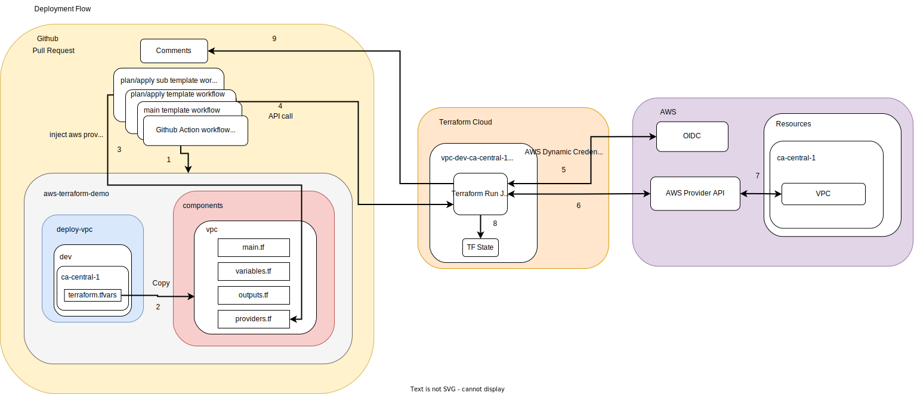

# AWS Terraform Demo 

This repo contains example terraform code and github actions workflow needed to deploy modular and scalable AWS infra with Terraform Cloud API

## To Do
- [x] Add integration with TF cloud
- [x] Add integration with Github Actions
- [x] Add deployement for VPC
- [x] Add deployement for EKS
- [x] Seperate AWS accounts support for dev/stgn/prod
- [ ] Multi Region support?
- [ ] Explore TF json format for automation and templating purpose
- [ ] Add deployment for Kubernetes (namespace, ingress, IAM....). Find a workaround for the providers alias not able to use variables
- [ ] Add component and deployement for DB
- [ ] Integration with terragrunt? (It seems complicated to get it work with both github actions and TF cloud)
- [ ] Refactor the github actions so we don't need a seperate yml for each component. Find workaround for github actions limitations


## Setup
* Create a Terraform Cloud account
* Setup dynamic credentials with AWS provider (https://developer.hashicorp.com/terraform/cloud-docs/workspaces/dynamic-provider-credentials/aws-configuration)
* Enable Github Actions
* Add the following repository env vars
    * TF_CLOUD_ORGANIZATION
* Add the following repository secret
    * TF_API_TOKEN
* Create a worksapce in Terraform Cloud for each type of resources you wish to deploy (VPC,EKS...)


* You can have a seperate AWS accounts associated to dev/stgn/prod. Add the following to the github repository variables. The value is the account number

```
TF_VARS_AWS_ALLOWED_ACCOUNTS_IDS_DEV
TF_VARS_AWS_ALLOWED_ACCOUNTS_IDS_STGN
TF_VARS_AWS_ALLOWED_ACCOUNTS_IDS_PROD
```

### To execute the terraform cloud runs locally 
https://developer.hashicorp.com/terraform/cloud-docs/run/cli

## Design choices


* The repository is structured to facilitate the deployment of various resource types, organized into folders named `deploy-xx` where `xx` corresponds to different types of resources. These folders contain `.tfvars` files that are used to configure the resources, and the resource configurations are neatly arranged in a map for better organization and readability.

* In the `components` folder, you'll find the Terraform modules necessary for deployment. These modules reference external Git repositories through data sources to pull in the base resource configurations. It's important to note that the `providers.tf` file within the `components` folder specifies the required version of the AWS provider. To ensure smooth deployments, the external Git repositories that the modules reference should use tags that match the AWS provider version specified.

* This setup is designed to provide a clear separation between resource configuration and module definition, which helps in keeping the repository orderly and the deployment process straightforward.

    ### Pros
     * Decoupled components and modules allows for easy upgrade without conflict. Child modules should be tagged and referenced in data source.
     * Seperate pipelines and tfstate for each type or resource, this limits the risk of unwanted changes and make the tfstate smaller ideally.
     * Decouple AWS provider version in for each pipeline. This is sometimes an issue when Terraform is going through major version upgrade, causing some resouces types to have breaking change. By decoupling the providers for each type of resource we isolate the breaking change to a single pipeline. Other resouces can sill proceed with the upgrade.
     * If the organization is not mono-repo, multiple Infra teams within the organization can re-use the same child modules this way.

    ### Cons
    * Adds complexity if you intend to organized multiple types of cloud resources in a "solution" (multiple type of resources managed at the same time as a part of a solution). It's more diffucult to make a tag on a specific release version of the infra for a specfic solution.
    * Upgrade and maintenance of child modules can become a problem in the long run with multiple versions. In a centralized repo all components must be up to date with modules with one single source of truth.
    * Each TFC workspace holds one tfstate for each env, so there could be lots of tfstate.


## Deployment flow


* Deployment uses pull request to tigger build pipelines using Terraform Cloud. Terraform change output will be added to the comments of the pull request