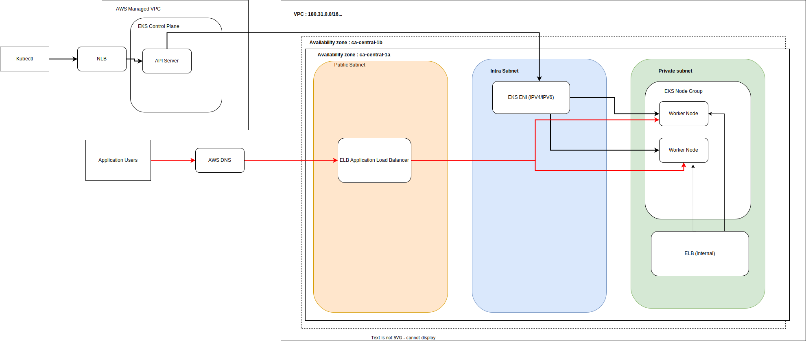

The terraform tfvars sets the variables declared in components/eks

## Folder Structure

The folder structure should be as follows:

``` ./ENV/AWS_REGION_NAME/terraform.tfvars ```

The ```AWS_REGION_NAME``` must be the exact name of the region. 
The ```ENV``` must be one of ```dev, stgn, prod```

## To Do

- [ x ] vpc_cni_irsa doesn't work with for_each. Move it to the eks child module
- [ ] aws_auth_roles doesn't work without the kubernetes provider. Create new kubenetes pipeline to manage everything kubernetes

## Diagram 

