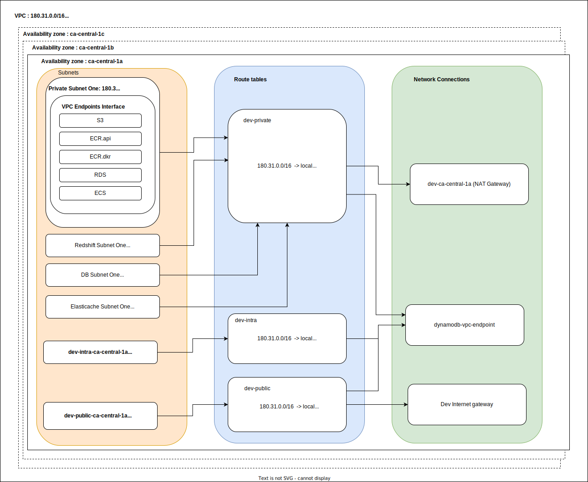

The terraform tfvars sets the variables declared in components/vpc.

## Folder Structure

The folder structure should be as follows:

``` ./ENV/AWS_REGION_NAME/terraform.tfvars ```

The ```AWS_REGION_NAME``` must be the exact name of the region. 
The ```ENV``` must be one of ```dev, stgn, prod```


# To Fix

- [ ] ecr_api and ecr_dkr are removed from the VPC endpoints. VPC endpoints currently don't support Amazon ECR Public repositories. Unfortunately EKS cluster managed add-on uses the public repositories. https://docs.aws.amazon.com/AmazonECR/latest/userguide/vpc-endpoints.html. Enabling the ECR VPC endpoint cause the image pull to fail when starting the nodes.

## Diagram 

